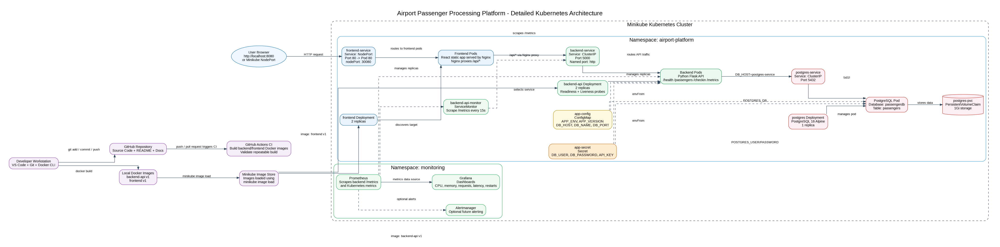
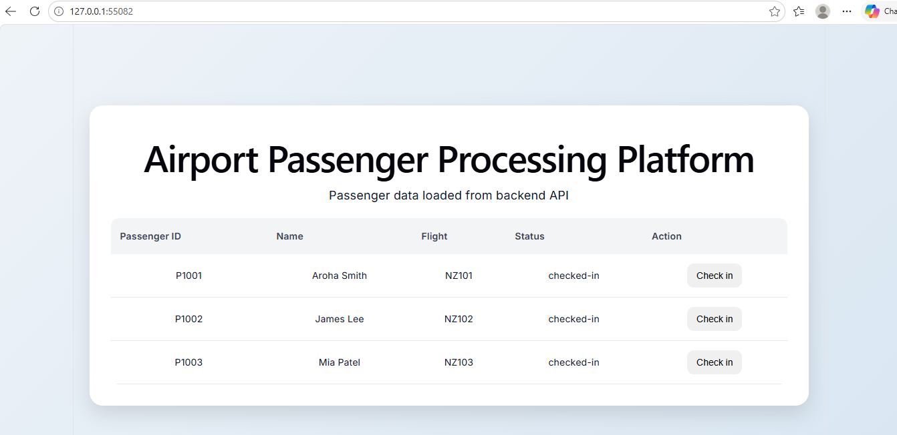
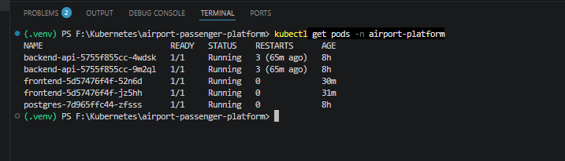
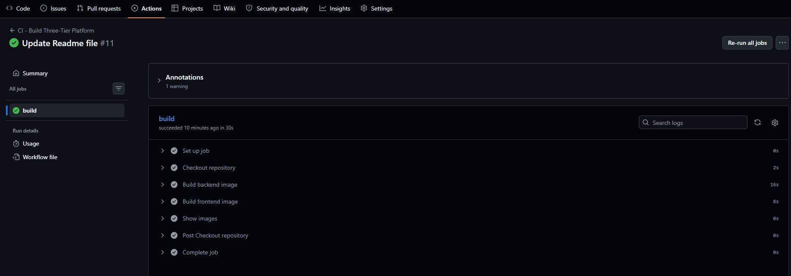
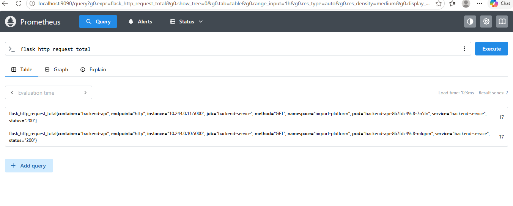
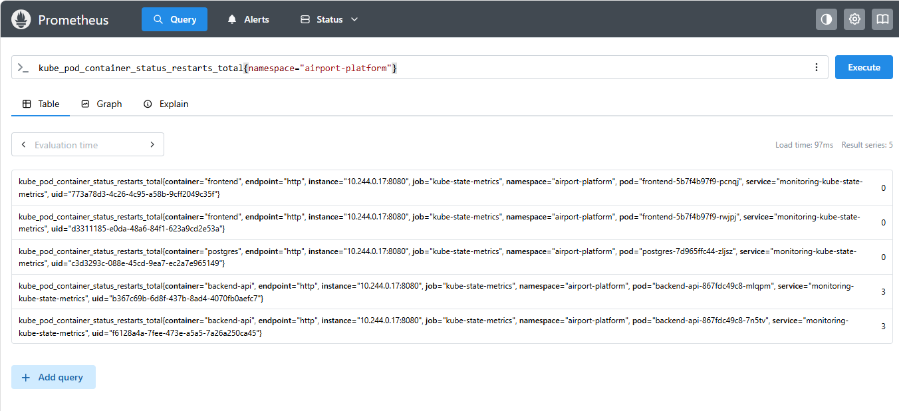
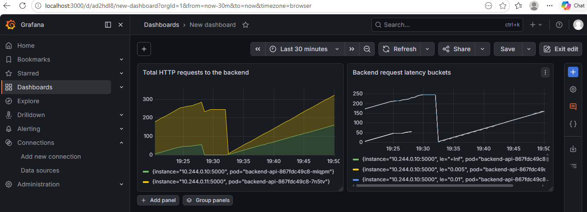

# Airport Passenger Processing Platform

A cloud-native three-tier application designed to demonstrate modern Platform Engineering, Kubernetes, Observability, DevOps, and Solution Architecture practices.

The platform simulates an airport passenger processing system that allows users to view passenger information and perform passenger check-in operations through a web-based interface while showcasing cloud-native deployment, monitoring, and operational capabilities.

---

## Project Objectives

This project was built to demonstrate practical experience with:

- Kubernetes Platform Engineering
- Cloud-Native Application Architecture
- Docker Containerization
- Continuous Integration (CI)
- Service Discovery and Configuration Management
- Observability using Prometheus and Grafana
- Operational Troubleshooting and Monitoring

---

## Architecture



### High-Level Flow

```text
Browser
   │
   ▼
Frontend Service (NodePort)
   │
   ▼
React + Nginx Frontend Pods
   │
   ▼
Backend Service (ClusterIP)
   │
   ▼
Python Flask API Pods
   │
   ▼
PostgreSQL Service
   │
   ▼
PostgreSQL Database
```

### Observability

```text
Backend Metrics (/metrics)
          │
          ▼
      Prometheus
          │
          ▼
        Grafana
```

Detailed architecture documentation:

📖 [Architecture Design Document](docs/architecture.md)

---

## Technology Stack

| Layer | Technology |
|---------|---------|
| Frontend | React, Vite, Nginx |
| Backend | Python Flask, Flask-CORS |
| Database | PostgreSQL |
| Containerization | Docker |
| Platform | Kubernetes, Minikube |
| CI | GitHub Actions |
| Monitoring | Prometheus |
| Visualization | Grafana |

---

## Key Capabilities

### Passenger Management

- Passenger retrieval
- Passenger status visibility
- Passenger check-in operations
- REST API integration

### Kubernetes Platform Engineering

- Deployments
- Services
- ConfigMaps
- Secrets
- PersistentVolumeClaims
- Readiness Probes
- Liveness Probes
- Scaling

### Observability

- Prometheus Metrics Collection
- Grafana Dashboards
- Application Health Monitoring
- Request Metrics
- Resource Utilization Monitoring

---

## Project Structure

```text
airport-passenger-platform/
│
├── frontend/
├── backend/
├── k8s/
├── docs/
│   ├── architecture.md
│   └── screenshots/
│
├── .github/
│   └── workflows/
│
└── README.md
```

---

## Current State

### Implemented

✅ Docker Containerization

✅ Kubernetes Deployments

✅ Service Discovery

✅ ConfigMaps & Secrets

✅ Persistent Storage

✅ Prometheus Metrics Collection

✅ Grafana Dashboards

✅ GitHub Actions Continuous Integration (CI)

✅ Operational Monitoring

### CI Strategy

GitHub Actions automatically validates:

- Backend Docker image builds
- Frontend Docker image builds

Current implementation focuses on **Continuous Integration (CI)**.

Deployment remains a manual process using Minikube and kubectl.

---

## Future State

Planned enhancements include:

- GitHub Actions CI/CD Pipeline
- Terraform Infrastructure as Code
- Kubernetes Ingress Controller
- AWS EKS Deployment
- Azure AKS Deployment
- Managed PostgreSQL
- Horizontal Pod Autoscaling (HPA)
- AlertManager Notifications
- Centralized Logging
- Container Security Scanning

---

## Screenshots

### Application UI



### Kubernetes Deployment



### GitHub Actions CI


### Prometheus Targets





### Grafana Dashboard



---

## Skills Demonstrated

### Solution Architecture

- Three-Tier Architecture
- API-Led Design
- Service Communication Patterns
- Architecture Documentation

### Platform Engineering

- Kubernetes Workload Management
- Configuration Management
- Service Discovery
- Persistent Storage

### DevOps

- Docker Image Creation
- GitHub Actions CI
- Git Workflows
- Build Validation

### Reliability Engineering

- Health Probes
- Scaling
- Monitoring
- Operational Troubleshooting

### Observability

- Prometheus Metrics
- Grafana Dashboards
- Application Monitoring
- Platform Visibility

---

## Learning Outcomes

This project provided hands-on experience with:

- Kubernetes
- Docker
- Platform Engineering
- Cloud-Native Architecture
- DevOps Practices
- Observability
- Reliability Engineering
- Solution Architecture

---

## Author

**Shehan Warnakulasuriya**

Senior Systems Analyst Specialist  
AWS Certified Solutions Architect – Associate  
Cloud & Platform Engineering  
Aspiring Solutions Architect